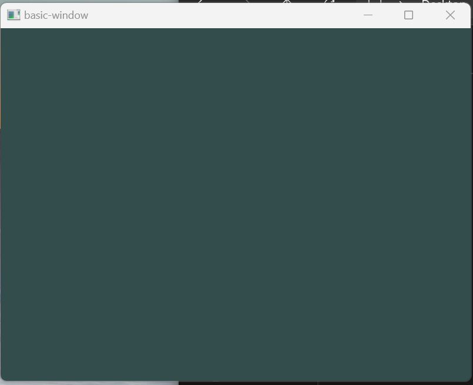

# OpenGL basic window
OpenGL basic window using **Glad** and **Glfw**

Glad files can be generated **[here](https://glad.dav1d.de/)**

Glfw can be download from **[here](https://github.com/glfw/glfw)**

For Glad, I chooded OpenGL 3.3

For Glfw, I download version 3.4 code.

To build, use this command
`make clean build`

If you launch bin/basic-window.exe, you should see this window:

